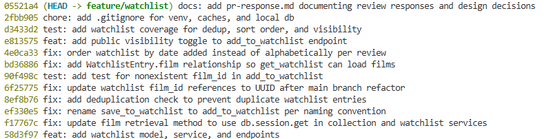

# PR Response Doc — CineLog Watchlist Feature

## AI Usage


I used AI tools in the following ways during this project:

- **Codebase orientation.** Before reading the review comments, I had AI summarize
  `models.py`, `services/collection_service.py`, and `tests/test_collection.py` —
  what each file is responsible for, what `add_to_collection()` returns when a film
  doesn't exist, and the fixture pattern the tests follow. I verified every summary
  against the actual code before relying on it.
- **Mechanical implementation support.** For the rename, deduplication, and the
  UUID rebase resolution, I used AI to double-check that I'd matched the existing
  `add_to_collection()` pattern (check order, exception naming, route error codes).
- **Commit-format check.** I gave my `git log --oneline` to AI and asked whether the
  messages follow conventional-commit format and whether any commit bundled more than
  one logical change, then verified against the conventional commits spec myself.
- **Drafting and pressure-testing the design arguments (Comments 4 and 5).** The
  positions themselves are mine — I decided to keep `public=True` with an explicit
  visibility toggle, and to switch the watchlist to date-added ordering with a note
  toward user-selectable sort. I then used AI to help articulate the written
  reasoning and to play devil's advocate on each one (what counterargument a careful
  reviewer would raise, what tradeoff I hadn't named). The tradeoff paragraphs — the
  privacy opt-in/opt-out point in Comment 4 and the "older films sink out of view"
  point in Comment 5 — came out of that back-and-forth. I reviewed the final wording
  against CineLog's context for accuracy before keeping it.

## Comment 1 — Rename
**What I did:** Renamed `save_to_watchlist()` to `add_to_watchlist()` in `services/watchlist_service.py` so it follows the project's `verb_to_noun` convention (matching `add_to_collection()`). I then updated the one call site in `routes/watchlist/watchlist.py` — both the `import` line and the call inside the `add_film` route.
**How I verified:** Ran a project-wide search for `save_to_watchlist` and confirmed zero remaining references. Ran the full test suite (`pytest tests/ -v`) — all tests still pass, confirming the rename didn't break the import chain or the route.

## Comment 2 — Deduplication
**What I did:** Added a duplicate check to `add_to_watchlist()`, mirroring `add_to_collection()` in `collection_service.py`. Before inserting, it queries for an existing `WatchlistEntry` with the same `user_id` + `film_id`; if one exists it raises a new `AlreadyInWatchlistError` (the watchlist analogue of `AlreadyInCollectionError`) instead of silently inserting a duplicate. To fully match the collection pattern I also added the `UniqueConstraint("user_id", "film_id")` to the `WatchlistEntry` model — `CollectionEntry` already had one but `WatchlistEntry` did not, so a race could still have created duplicates at the DB level. Finally I wrapped the route handler in try/except so a duplicate returns HTTP 409 (and a missing film returns 404) rather than a 500, matching `routes/collection.py`.
**How I verified:** Compared line-by-line against `add_to_collection()` to confirm the check order (film-exists first, then duplicate check) is identical. Added `test_add_to_watchlist_duplicate_raises`, which asserts the second add raises and that only one row exists. Full suite green.

## Comment 3 — Missing test
**What I did:** Created `tests/test_watchlist.py` and wrote `test_add_to_watchlist_nonexistent_film_raises`, the watchlist equivalent of `test_add_to_collection_nonexistent_film_raises`. I reused the same `app` and `sample_user` fixtures (in-memory SQLite, app-context teardown) so the test matches the existing style, and asserted that adding a nonexistent `film_id` raises `FilmNotFoundError` rather than a database integrity error.
**How I verified:** Ran `pytest tests/test_watchlist.py -v` (passes) and then the full suite `pytest tests/ -v` to confirm the new file integrates cleanly.

## Comment 4 — Default visibility
**My position:** Keep `public=True` as the default, but add an explicit `public` parameter to the add endpoint so callers can opt into privacy per entry.

**Reasoning:** CineLog is a *community* film-tracking app — its value comes from social discovery: seeing what other people plan to watch, surfacing recommendations, following users with similar taste. If watchlists were private by default, the community surface would be empty at exactly the moment it needs content to feel alive, and most users would never flip the switch. A public default also keeps the watchlist consistent with how the rest of the app already treats a user's activity as a shared, community-facing signal, so we're not asking users to learn two different privacy models. For the common case — a user adds a film expecting it to contribute to the community — public-by-default is the lowest-friction, most on-purpose choice.

**Tradeoff acknowledged:** The cost is privacy. Some users add films they'd rather not broadcast (guilty pleasures, gift research, sensitive subjects), and a public default forces them to remember to opt out. "Privacy as opt-out" is genuinely weaker than "privacy as opt-in" under the principle of least astonishment and modern data-protection norms — this is the strongest argument for flipping the default, and I don't want to hand-wave it. I mitigated it by adding the explicit `public` parameter (see the Stretch visibility toggle) so a UI can offer per-entry control today, and I'd recommend a fast follow-up: a per-user "default visibility" setting so privacy-conscious users flip it once instead of per film.

## Comment 5 — Sort order
**My position:** I agree with you — I changed the default to date-added (newest first), and I think the right *long-term* answer is user-selectable sort.

**Reasoning:** I implemented `order_by(WatchlistEntry.date_added.desc())` in `get_watchlist()`, replacing the alphabetical sort.

**Engagement with reviewer's point:** Your reasoning holds specifically for a watchlist. A watchlist is a *queue of intent*, not a reference catalog — when I open it I'm usually asking "what did I just add that I want to watch soon?", and recency answers that directly while alphabetical doesn't. It also makes the watchlist consistent with `get_collection()`, which already returns newest-first, so both lists behave the same way. My original alphabetical choice was optimizing for a different task — "find a specific title I know I saved" — which is real but rarer, and is better served by search/filter than by the default sort. Where I'd push slightly: the truly correct answer isn't one global default but a `sort` option (date-added, title, release year, rating). Date-added is the best default to ship now; I'd log a follow-up for a `sort` query parameter so the "find a specific title" case is served without overloading the default. Tradeoff: date-added pushes older-but-still-wanted films toward the bottom where they're easy to forget, which selectable sort (or an "oldest first" toggle) would address.

## Comment 6 — Rebase
**What conflicted:** `main` migrated `Film.id` (and `CollectionEntry.film_id`) from `Integer` to UUID (`String(36)`). My branch introduced `WatchlistEntry` with `film_id = db.Column(db.Integer, db.ForeignKey("film.id"))`. Rebasing `feature/watchlist` onto the updated `main` produced a content conflict in `models.py`: `main` had no `WatchlistEntry` at all, and my `WatchlistEntry.film_id` was still `Integer` pointing at a now-UUID `film.id`.

**How I resolved it:** I kept the `WatchlistEntry` model but changed `film_id` to `db.Column(db.String(36), db.ForeignKey("film.id"))` to match the new UUID `Film.id`, and updated the now-stale integer references in the docstrings of `add_to_watchlist()` and the add route (`Body: { "film_id": <int> }` → `"<uuid>"`). I put this migration in its own commit (`fix: update watchlist film_id references to UUID after main branch refactor`) so it's a discrete, reviewable change rather than hidden inside the dedup commit.

**Bug found while verifying the UUID path:** Driving the endpoints end-to-end, I found `get_watchlist()` called `entry.film.to_dict()`, but `WatchlistEntry` had no `film` relationship (only `CollectionEntry` did), so `GET /watchlist/<user_id>` would 500. The `.join(Film)` in the query does not populate `entry.film`; a `db.relationship` does. I added `Film.watchlist_entries = db.relationship("WatchlistEntry", backref="film", lazy=True)`, mirroring the collection relationship.

**How I verified no conflict remains:** `git status` is clean; `git log --merges origin/main..HEAD` is empty (a true rebase, no merge commits); `git grep '<<<<<<<'` finds no conflict markers; `pytest tests/ -v` passes (8 tests); and an end-to-end script creates a UUID film, adds it to a watchlist, re-adds it (confirming the 409/dedup path), and reads the watchlist back.

## Stretch features completed
- **Visibility toggle:** Added the `public` parameter to `add_to_watchlist()` and the add endpoint (documented under Comment 4).
- **Additional tests:** Beyond the required nonexistent-film test, `tests/test_watchlist.py` also covers deduplication, date-added sort order, and the visibility toggle. I chose the sort-order case because it's the behavior Comment 5 changed and it's the easiest thing to silently regress.

## git log --oneline
Rewritten history on `feature/watchlist` — 12 conventional commits, one logical change each, no merge commits:



<details><summary>Text version of the log</summary>

```
05521a4 docs: add pr-response.md documenting review responses and design decisions
2fbb905 chore: add .gitignore for venv, caches, and local db
d3433d2 test: add watchlist coverage for dedup, sort order, and visibility
e813575 feat: add public visibility toggle to add_to_watchlist endpoint
4e0ca33 fix: order watchlist by date added instead of alphabetically per review
bd36886 fix: add WatchlistEntry.film relationship so get_watchlist can load films
90f498c test: add test for nonexistent film_id in add_to_watchlist
6f25775 fix: update watchlist film_id references to UUID after main branch refactor
8ef8b76 fix: add deduplication check to prevent duplicate watchlist entries
ef330e5 fix: rename save_to_watchlist to add_to_watchlist per naming convention
f17767c fix: update film retrieval method to use db.session.get in collection and watchlist services
58d3f97 feat: add watchlist model, service, and endpoints
```
</details>

## PR Description
**What the watchlist feature does:** Lets a user save films they want to watch later, separate from their collection (films already watched). It adds a `WatchlistEntry` model, `add_to_watchlist()` / `get_watchlist()` service functions, and REST endpoints: `POST /watchlist/<user_id>/add` (body `{ "film_id": "<uuid>", "public": true }`, `public` optional) and `GET /watchlist/<user_id>`. Adding a film that doesn't exist returns 404; adding a film already on the watchlist returns 409. The list is returned newest-first.

**Design decisions made:**
1. **Default visibility** — watchlist entries default to `public=True` (community discovery), with an explicit `public` parameter so callers can create private entries. Full reasoning and tradeoff under Comment 4.
2. **Sort order** — the watchlist is sorted by date added (newest first) to match the "what did I just add" mental model and stay consistent with the collection. Reasoning under Comment 5.

**How to manually test:**
1. `python -m venv .venv` and activate it; `pip install -r requirements.txt`.
2. Start the app: `python app.py` (runs at `http://127.0.0.1:5000`; there is no frontend, so `/` returns 404 — that's expected).
3. Create a user and a film (via the films endpoints / a quick shell using the models) and note their UUIDs.
4. Add to watchlist:
   `curl -X POST http://127.0.0.1:5000/watchlist/<user_id>/add -H "Content-Type: application/json" -d '{"film_id":"<film_uuid>"}'` → expect `201` and a JSON entry with `"public": true`.
5. Add the same film again → expect `409` (deduplication).
6. Add with `-d '{"film_id":"<film_uuid>","public":false}'` for a second film → expect `"public": false`.
7. Add a nonexistent film id → expect `404`.
8. `curl http://127.0.0.1:5000/watchlist/<user_id>` → expect the films newest-first.
9. Or just run the suite: `pytest tests/ -v` (8 passing).
